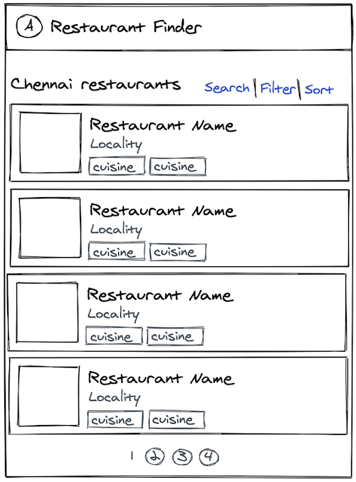

# Restaurant Finder Web App

A basic Restaurant Finder Web App

## Basic Features

- Owner should be able to add restaurant with basic information (name, location), cuisines and dishes
- User must select the city he’s looking to search the restaurant
- The listing page must display the paginated restaurants
- On clicking the restaurant, it should navigate to the details page and show all the relevant information

## Advance Features

- Implementing search by restaurant name, dishes
- Implementing filter by location, cuisine
- Infinite scroll pagination for the listing page
- Use Geolocation to automatically set the user location & get the nearby restaurants

## Bonus

- Unit test with any framework
- Hosting

## Tips

- Usability is more critical than aesthetics
- Do git commits as you would during a normal workday

## Reference Wireframes

### City Selection

### Restaurants List page

### Restaurant Detail page

